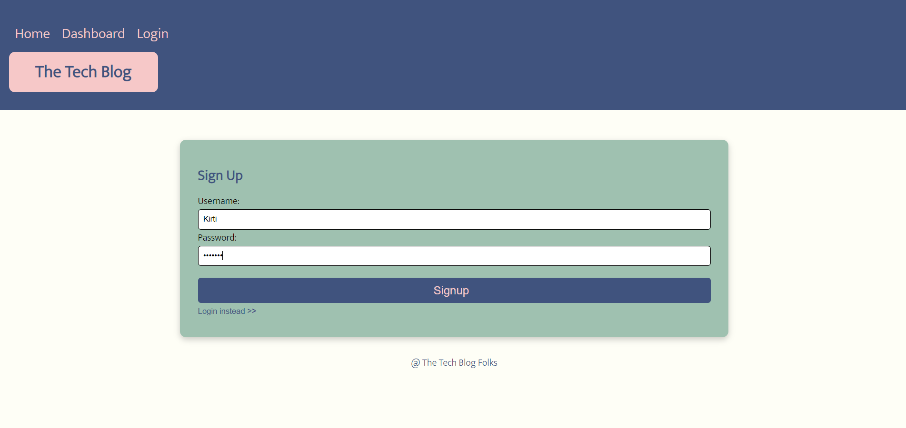
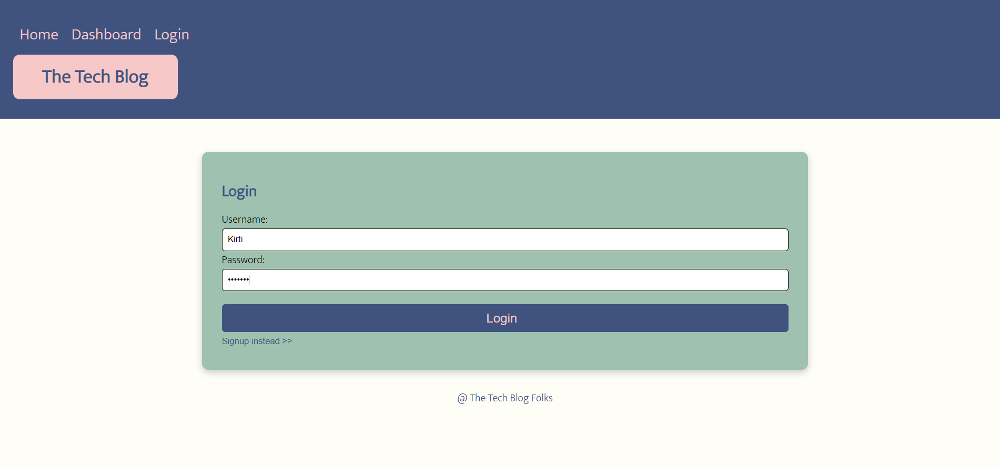
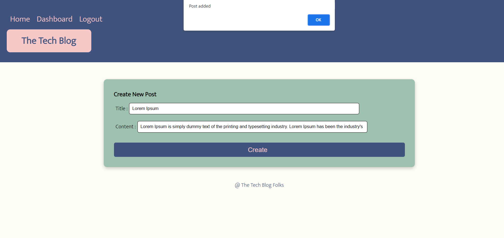
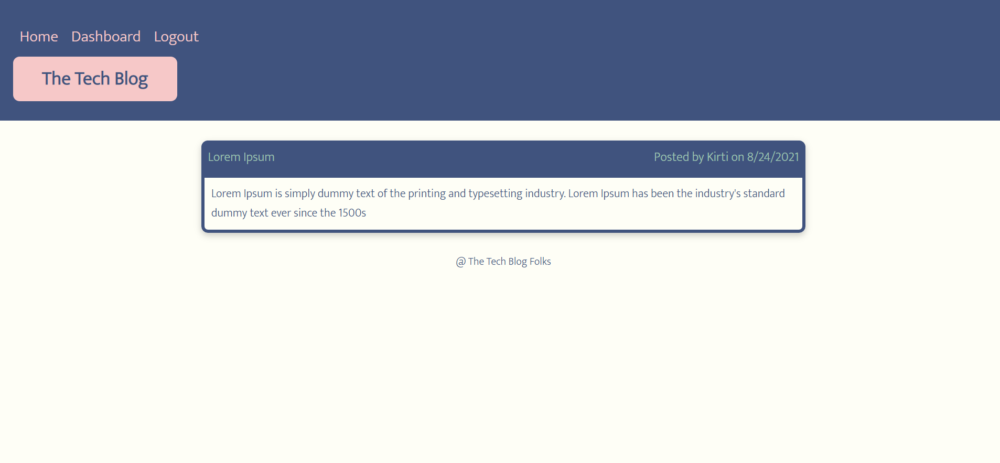
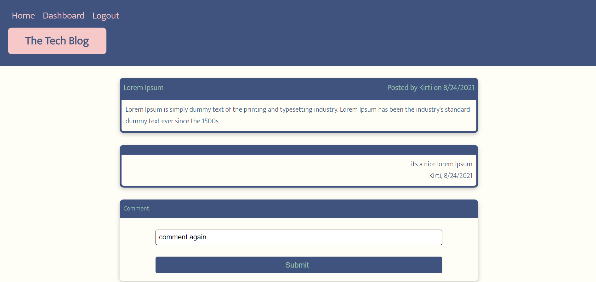

# Tech Blog

## Description: 
A tech blog web application which allows developers to publish their blog posts and comment on other developers’ posts as well.

## Table of Contents
* [License](#license)
* [Preview](#preview)
* [Usage](#usage)
* [Links](#links)
* [Tools](#tools)
* [Credits](#credits)

## License

  

  MIT Link is : [https://opensource.org/licenses/MIT](https://opensource.org/licenses/MIT)

## Preview

## Usage
Developers can see all the posts available in home page. Once user is registered and logged in, able to access dashboard. In dashboard they see their own posts, add, edit or delete posts as well. user can comment on posts from home page.

## Links
•	[Heroku Deployment](https://ktech-blog.herokuapp.com/)

## Tools
* Node.js
* Express.js
* Handlebars.js
* MySQL and Sequelize ORM
* jQuery
* dotenv

## Credits
Created By:
 * [Kirti Patel]( https://github.com/kirti18patel)